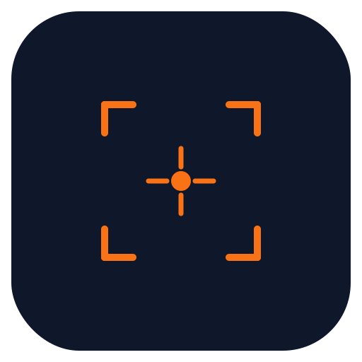
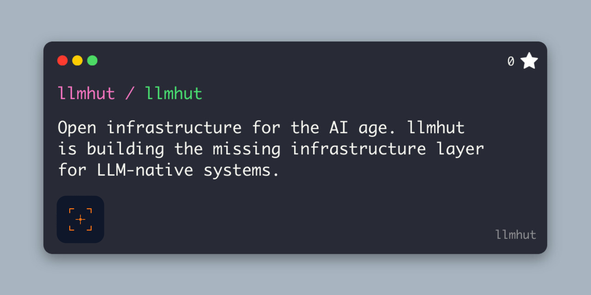

<p align="center">
  
</p>

<h1 align="center">LLM Hut</h1>

<p align="center">
  <strong>Open infrastructure for the AI age.</strong><br/>
  The missing infrastructure layer for LLM-native systems — from discovery and access control to runtime and beyond.
</p>

<p align="center">
  <a href="http://www.llmhut.com">Website</a> · <a href="https://github.com/llmhut">GitHub Org</a> · <a href="#projects">Projects</a> · <a href="#roadmap">Roadmap</a>
</p>

---

## What is LLM Hut?



Building with LLMs today is fragmented. Teams share API keys over Slack. Nobody knows which SDKs or frameworks are running in the codebase. There's no standard way to swap providers, enforce budgets, or maintain an audit trail.

LLM Hut is building the foundational infrastructure layer to fix this — modular, open-source tools that cover the full AI operations lifecycle from development to production. Each project works standalone or as part of a unified stack.

---

## Projects

LLM Hut is organized into composable layers. The first three are available today:

### 🔍 ai-scanner — Discovery

> *Know what's in your codebase.*

Scan any codebase for LLM SDK usage, AI framework integrations, and exposed API tokens. Ships as a CLI, a Node.js library, and an MCP server compatible with Claude Code, Cursor, and Windsurf.

- 145 detection patterns across 23 SDKs and 24 frameworks
- Zero dependencies
- MIT licensed

```bash
npx ai-scanner ./src --tokens-only --exit-code
# ✓ clean · 23 SDKs detected · 0 exposed keys · 2 frameworks
```

**Repo:** [llmhut/ai-scanner-mcp](https://github.com/llmhut/ai-scanner-mcp) · **Docs:** [ai-scanner docs](https://aakashbhardwaj27.github.io/ai-scanner/)

---

### 🔑 KeyGate — Access Control

> *Secure, scoped API keys — not proxy tokens.*

Provision per-developer, per-team vendor API keys with real vendor-level enforcement. Supports instant revocation, key rotation, budget caps, rate limits, and an immutable audit log.

- Supports OpenAI, Anthropic, Azure, and GCP
- Docker-ready
- Apache 2.0 licensed

```bash
POST /keys/provision {"developer":"priya","vendor":"openai"}
# ✓ sk-proj-...7xKm · scoped · $100 cap · logged
```

**Repo:** [llmhut/keygate](https://github.com/llmhut/keygate) · **Docs:** [KeyGate docs](https://aakashbhardwaj27.github.io/keygate/)

---

### ⚡ Gateway — Runtime

> *Provider-agnostic LLM routing.*

A blazing-fast LLM gateway written in Go. Swap providers, load-balance, and retry transparently — without changing your SDK code.

- Sub-millisecond overhead
- Zero external dependencies
- Supports OpenAI, Anthropic, Gemini, Groq, and Bedrock

```bash
docker run -p 8080:8080 ghcr.io/llmhut/gateway
# → ready · <1ms overhead · 4 providers · no deps
```

**Repo:** [llmhut/gateway](https://github.com/llmhut/gateway)

---

## Roadmap

| Layer | Status |
|---|---|
| 🔍 Discovery (ai-scanner) | ✅ Available |
| 🔑 Access Control (KeyGate) | ✅ Available |
| ⚡ Runtime (Gateway) | ✅ Available |
| 📊 Observability — request tracing, token dashboards, cost attribution | 🔜 Coming soon |
| 🧪 Eval Pipeline — structured evaluations, CI/CD ready | 📋 Planned |
| 🚢 Deployment Primitives — opinionated tooling for shipping LLM services | 📋 Planned |
| 🔔 Event System — webhooks, usage thresholds, anomaly alerts | 📋 Planned |

---

## Why LLM Hut?

Every major technology wave produced a foundational open-source infrastructure layer. The web got nginx, Redis, and Kafka. The AI wave deserves the same.

| Classic Infra | LLM Hut Equivalent |
|---|---|
| nginx (routing) | **Gateway** |
| Vault (secrets) | **KeyGate** |
| Snyk (code audit) | **ai-scanner** |
| Datadog (observability) | llm-obs *(coming soon)* |
| Jenkins (CI/CD) | eval pipeline *(planned)* |

**End-to-end ownership** — one cohesive stack covering the full AI lifecycle.
**Developer-first** — minimal setup, works with existing SDKs, no vendor lock-in.
**Provider-agnostic** — OpenAI, Anthropic, Gemini, Groq, Bedrock under one layer.
**Open by default** — fully open-source, extensible, community-driven.
**Security first** — no shared secrets, no proxy risk, vendor-level enforcement.
**Composable** — use one layer or all. Each project works standalone.

---

## Contributing

LLM Hut is community-driven. Every issue filed, PR merged, and detection pattern contributed makes the stack better for everyone building AI systems.

- ⭐ **Star the repos** — help others discover the projects
- 🐛 **Report issues** — [open an issue](https://github.com/llmhut/ai-scanner-mcp/issues)
- 🔧 **Contribute code** — new vendor integrations, detection patterns, routing strategies — [submit a PR](https://github.com/llmhut/gateway/pulls)

---

## License

Individual projects are licensed under **MIT** or **Apache 2.0** — see each repository for details.

---

<p align="center">
  Open-source · Built with ❤️ in India 🇮🇳 · <a href="https://github.com/llmhut">github.com/llmhut</a>
</p>